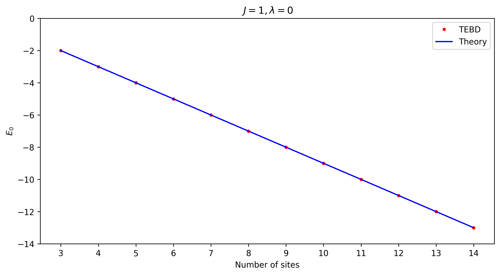

# Time-evolving Block Decimation with Matrix Product States

This package implements the TEBD algorithm for MPS.

## Installation

The required Python version is in `.python-version`. If you have `pyenv` installed, it'll point to that version
automatically. To create a virtual environment and install the package, run:

```
python -m venv env
source env/bin/activate
pip install -e .
```

## Execution

The time evolution step is given by the following tensor network:


This contracted tensor network represents the local density matrix:


The average energy of two sites is:


## Results

The TEBD algorithm was run for 500 iterations using a timestep of 0.01 for various values of $N$ (the number of sites). 
The initial wavefunction was randomized. Below is a plot of the ground state energy as a function of $N$ for the case
of $\lambda = 0$.


